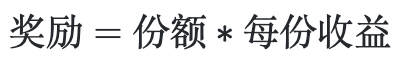

# Introduction

We will introduce the technical details of all Connexion smart contracts, including parts like FT, NFT, Treasury vaults and Marketplace. 


# ERC20 Token Contract
 
 Other than the basic functions of a Fungible Token, we also need to provide a one-click smart contract creation function. In order to realize this, we have developed three contracts, in the name of GameERC20Factory.sol, GameERC20Proxy.sol and GameERC20Token.sol. Their relationships are shown as below:

 

 For those who are unfamiliar with the delegatecall instruction, here is a simple explanation. Smart Contract A calls Smart Contract B via the delegatecall instruction, the transaction will execute according to the logics set by Contract B, however, the contexts of the execution and its status change are stored in Contract A. We call Contract A Proxy contract，Contract B Implementation contract. GameERC20Proxy is the Proxy contract, storing token status. Users are able to create any number of GameERC20Proxy cases via GameERCFactory, every case is a token. All tokens created by GameERC20Factory have the same implementation contract in GameERC20Token.

## GameERC20Factory

### Storage variable

#### vaultCount

```solidity
uint256 public vaultCount;
```

 Vaultcount represents the total generated token count

#### vaults

```solidity
mapping(uint256 => address) public vaults;
```

 Vaults store the address for the generated tokens

#### logic

```solidity
address public immutable logic;
```

 Logic is the logic contract address for all tokens. We use an unchangeable variable to store the logic contract addresses to make sure that the token logic address is the same for every token created by factory.


### Functions

#### Generate

```solidity
function generate(
    string memory _name,
    string memory _symbol,
    uint256 _cap
) external whenNotPaused returns (uint256 _index) {
    bytes memory _initializationCallData =
    abi.encodeWithSignature(
        "initialize(string,string,uint256,address)",
        _name,
        _symbol,
        _cap,
        msg.sender
    );

    address vault = address(
        new GameErc20Proxy(
            logic,
            _initializationCallData
        )
    );

    vaults[vaultCount] = vault;
    vaultCount++;

    return vaultCount - 1;
}
```

Generate is a function to create new token

Parameters:

Name | Type | Description
--------- | ------- | -----------
_name | string | token's name
_symbol | string | token's symbol
_cap | uint256 | token’s maximum amount

Return Values:

Name | Type | Description
--------- | ------- | -----------
_index | uint256 | token index number in the underlying set 

 
 
 


## GameErc20Proxy

### Storage variable

#### logic

```solidity
address public immutable logic;
```

 Logic is the logic contract address for all tokens. We use an unchangeable variable to store the logic contract address to make sure that the logic of the token cannot be changed. Upgradeable smart contracts are realized by changing logic contracts.

### Functions

#### fallback

```solidity
fallback() external payable {
    address _impl = logic;
    assembly {
        let ptr := mload(0x40)
        calldatacopy(ptr, 0, calldatasize())
        let result := delegatecall(gas(), _impl, ptr, calldatasize(), 0, 0)
        let size := returndatasize()
        returndatacopy(ptr, 0, size)
        switch result
            case 0 {
                revert(ptr, size)
            }
            default {
                return(ptr, size)
            }
    }
}
```

 fallback is an important function to realize proxy contracts. The concepts of a proxy contract is outlined in [EIP1167](https://github.com/ethereum/EIPs/blob/master/EIPS/eip-1167.md), with the following characteristics:

 1. Return true when successfully called, the returned data cannot be managed
 2. When the calling function does not exist in the proxy contract, the contract will call fallback function instead. We can set up the logic in fallback function to deal with such issues. Proxy contracts using a customized fallback function will redirect the call request to the logic contract.
 3. Every time when Contract A use delegatecall function to call Contract B, the transaction will be implemented in the context set up by contract A, using logics from Contract B. The transaction will keep the data msg.value and msg.sender in Contract A. Every alteration to the storage will affect Contract A. The status in Contract B will not be changed.

 We can also refer to the realization of Openzeppelin smart contract library via [Openzeppelin Proxy](https://github.com/OpenZeppelin/openzeppelin-labs/blob/master/upgradeability_using_eternal_storage/contracts/Proxy.sol).

## GameERC20Token

```solidity
function mint(address account, uint256 amount) public onlyOwner {
  if (totalSupply() + amount > cap)
      amount = cap - totalSupply();
  _mint(account, amount);
}
```

 The way for addresses with owner permission to mint  tokens. The total minted amount cannot exceed the default total supply.

Parameters:

Name | Type | Description
--------- | ------- | -----------
account | address | address receiving minted tokens
amount | uint256 | minted amount


# General multi-game NFT token Contract

 Loot was defined as the new paradigm for NFT. On the smart contract coding level, the innovation of loot rests in that it attempts to record the attributes of NFT on the decentralized system, resolving the problem for normal NFTs, which is that their metadata can be easily modified by their creators. On the artistic level, Loot intentionally omits images, allowing developers to fully use their imagination, portraying different images for the same Loot.

 Although Loot demonstrates significant improvements from traditional NFTs, it still has its weaknesses. The attribute types in Loot are quite limited, and concrete. For instance, “Warring Axe” is an attribute from the first generation of Loot. Though artists are able to freely design the visualization of Warring Axe, it can only be a Warring Axe. The imaginations of artistics are constrained into that specific object. 

 Inspired by Loot’s strengths and weaknesses, we made a new innovation, replacing the text attributes in Loot with numbers and unbounding the count of attributes in a single NFT. Thus the same NFT can act as different roles in different scripts, becoming a bridge connecting different game metaverses. 

 The meaning of NFT properties in each game world will be hosted by the Registry contract, and users can query the corresponding values on the chain. We will also provide the `TokenURIGame` function to generate an SVG containing the attribute name, let's take a look at the relationship between these two contracts:

 

 The Registry contract represents the data of a specific game. When a player wants to view the image of his NFT in a specific game, he can view it through the `TokenURIGame` method. TokenURI returns metadata that does not contain any game elements. In order to meet the EIP721 standard and ensure that it can be displayed normally on Opensea.

 For Connexion, we created a GameFi specific NFT Standard:[Non-fungible Token for GameFi](https://github.com/bnb-chain/BEPs/pull/129)。

## Storage variable

> Data structure to store properties

```solidity
struct AttributeBaseData {
    uint8 decimal;
    bool exist;
}

struct AttributeData {
    uint128 attrID;
    uint128 attrValue;
}

// attrID => decimal
mapping(uint128 => AttributeBaseData) internal _attrBaseData;
// tokenID => attribute data
mapping(uint256 => AttributeData[]) internal _attrData;
```

`AttributeBaseData` stores the precision of a single attribute, resolving the issue with decimals.

`AttributeData` stores the attribute ID and attribute value.

`_attrBaseData` is a key-value pair, key is the attribute ID, value is the attribute’s basic info (precision, created or not), used to search an attribute's precision.

`_attrData` is also a key-value pair, key is tokenID, value is the NFT’s attribute array.

## Functions

### tokenURI

> A method of displaying NFT attributes through SVG

```solidity
function tokenURI(uint256 tokenID) override public view returns (string memory) {
    AttributeData[] memory attrData = _attrData[tokenID];

    string memory output = '<svg xmlns="http://www.w3.org/2000/svg" preserveAspectRatio="xMinYMin meet" viewBox="0 0 350 350"><style>.base { fill: white; font-family: serif; font-size: 14px; }</style><rect width="100%" height="100%" fill="black" /><text x="10" y="20" class="base">ID</text><text x="80" y="20" class="base">Value</text><text x="185" y="20" class="base">ID</text><text x="255" y="20" class="base">Value';

    string memory p1 = '</text><text x="10" y="';
    string memory p2 = '</text><text x="80" y="';
    string memory p3 = '</text><text x="185" y="';
    string memory p4 = '</text><text x="255" y="';
    string memory p5 = '" class="base">';

    bytes memory tb;
    for (uint256 i; i < _attrData[tokenID].length; i++) {
        uint128 id = attrData[i].attrID;
        uint128 value = attrData[i].attrValue;
        if (i % 2 == 0) {
            string memory y = toString(40 + 20 * i / 2);
            tb = abi.encodePacked(tb, p1, y, p5, toString(id), p2, y, p5, toString(value));
        } else {
            string memory y = toString(40 + 20 * (i - 1) / 2);
            tb = abi.encodePacked(tb, p3, y, p5, toString(id), p4, y, p5, toString(value));
        }
    }
    tb = abi.encodePacked(tb, '</text></svg>');

    string memory json = Base64.encode(bytes(string(abi.encodePacked('{"name": "Bag #', toString(tokenID),
        '", "description": "GameLoot is a general NFT for games. Images, attribute name and other functionality are intentionally omitted for each game to interprets. You can use gameLoot as you like in a variety of games.", "image": "data:image/svg+xml;base64,',
        Base64.encode(abi.encodePacked(output, tb)), '"}'))));
    output = string(abi.encodePacked('data:application/json;base64,', json));

    return output;
}
```

 Similar to Loot, we use SVG to display an NFT’s attributes.
 
Parameters:

Name | Type | Description
--------- | ------- | -----------
tokenID | uint256 | NFT’s unique ID

Return Values:

Name | Type | Description
--------- | ------- | -----------
output | string | String value after Base64 conversion of the SVG data

### create

> Create a single property

```solidity
function create(uint128 attrID_, uint8 decimals_) override public onlyOwner {
    super.create(attrID_, decimals_);
}
```

 Only addresses with owner permission can create attributes, existing attributeID cannot be re-created.
 
Parameters:

Name | Type | Description
--------- | ------- | -----------
attrID_ | uint128 | NFT attribute’s unique ID
decimals_ | uint8 | precision of the attribute

### createBatch

> Create multiple properties

```solidity
function createBatch(uint128[] memory attrIDs_, uint8[] memory decimals_) override public onlyOwner {
    super.createBatch(attrIDs_, decimals_);
}
```

 Only addresses with owner permission can create attributes, existing attributeID cannot be re-created.
 
Parameters:

Name | Type | Description
--------- | ------- | -----------
attrIDs_ | uint128[] | NFT attribute’s unique ID arrays
decimals_ | uint8[] | precision of the attributes, correspondent to every attribute

### attach

> Add a single attribute to the NFT attribute list

```solidity
function attach(uint256 tokenID_, uint128 attrID_, uint128 value_) override public onlyTreasure {
    _attach(tokenID_, attrID_, value_);
}
```

 Add an attribute and its corresponding value to the NFT attributes list, only [treasure contract](#treasure-contract) have the permission to call this function
 
Parameters:

Name | Type | Description
--------- | ------- | -----------
tokenID_ | uint256 | NFT’s unique ID
attrID_ | uint128 | NFT attribute’s unique ID
value_ | uint128 | NFT attribute’s value

### attachBatch

> Add multiple attributes to NFT attribute list

```solidity
function attachBatch(uint256 tokenID_, uint128[] memory attrIDs_, uint128[] memory values_) override public onlyTreasure {
    _attachBatch(tokenID_, attrIDs_, values_);
}
```

 Add a batch of attributes and their corresponding values to the NFT attribute list, only [treasure contract](#treasure-contract) have the permission to call this function
 
Parameters:

Name | Type | Description
--------- | ------- | -----------
tokenID_ | uint256 | NFT’s unique ID
attrIDs_ | uint128[] | NFT attribute array’s unique ID
values_ | uint128[] | NFT attribute’s value array, corresponding to every attribute array’s unique ID

### remove

> Remove a single attribute from the NFT attribute list

```solidity
function remove(uint256 tokenID_, uint256 attrIndex_) override public onlyTreasure {
    _remove(tokenID_, attrIndex_);
}
```

 Removing attributes from the NFT attribute list via attribute index. If the index is beyond the attribute array’s range, this function will fail. Only [treasure contract](#treasure-contract) have the permission to call this function.
 
Parameters:

Name | Type | Description
--------- | ------- | -----------
tokenID_ | uint256 | NFT’s unique ID
attrIndex_ | uint256 | Attribute corresponding index in the NFT attribute list

### removeBatch

> Remove multiple attributes from NFT attribute list

```solidity
function removeBatch(uint256 tokenID_, uint256[] memory attrIndexes_) override public onlyTreasure {
    _removeBatch(tokenID_, attrIndexes_);
}
```

 Removing a batch of attributes from the NFT attribute list via multi attribute indexes. If the indexes are beyond the attribute array’s range, this function will fail. Only [treasure contract](#treasure-contract) can call this function.
 
Parameters:

Name | Type | Description
--------- | ------- | -----------
tokenID_ | uint256 | NFT’s unique ID
attrIndexes_ | uint256[] | Attribute corresponding index arrays in the NFT attribute list

### update

> Update the value of an NFT single property

```solidity
function update(uint256 tokenID_, uint256 attrIndex_, uint128 value_) override public onlyTreasure {
    _update(tokenID_, attrIndex_, value_);
}
```

 Updaing the value of an attribute via attribute index. If the index is beyond the attribute array’s range, this function will fail. Only [treasure contract](#treasure-contract) can call this function.
 
Parameters:

Name | Type | Description
--------- | ------- | -----------
tokenID_ | uint256 | NFT’s unique ID
attrIndex_ | uint256 | Attribute corresponding index in the NFT attribute list
value_ | uint128 | Updated value of the attribute

### updateBatch

> Update the values of multiple properties of an NFT

```solidity
function updateBatch(uint256 tokenID_, uint256[] memory attrIndexes_, uint128[] memory values_) override public onlyTreasure {
    _updateBatch(tokenID_, attrIndexes_, values_);
}
```

 Updating the value of multiple attributes via attribute indexes. If the indexes are beyond the attribute array’s range, this function will fail.  Only [treasure contract](#treasure-contract) can call this function.
 
Parameters:

Name | Type | Description
--------- | ------- | -----------
tokenID_ | uint256 | NFT’s unique ID
attrIndexes_ | uint256[] | Attribute corresponding index arrays in the NFT attribute list
values_ | uint128[] | set of updated values for the attribute array, corresponding to every attriIndexes_

# Treasure contract

> One of the ways to recover the signer using the ecrecover instruction

```solidity
function signatureWallet(
    address _wallet,
    address _this,
    address _token,
    uint256 _tokenID,
    uint256 _nonce,
    uint128[] memory _attrIDs,
    uint128[] memory _attrValues,
    uint256[] memory _attrIndexesUpdate,
    uint128[] memory _attrValuesUpdate,
    uint256[] memory _attrIndexesRMs,
    bytes memory _signature
) internal pure returns (address){
    bytes32 hash = keccak256(
        abi.encode(_wallet, _this, _token, _tokenID, _nonce, _attrIDs, _attrValues, _attrIndexesUpdate, _attrValuesUpdate, _attrIndexesRMs)
    );
    return ECDSA.recover(ECDSA.toEthSignedMessageHash(hash), _signature);
}
```

 Treasury contract is the interactive portal between the blockchain and the centralized game system, we will first take a look at the asset flow chart:

 
 
 All in-game asset (FT and NFT) deposits from the blockchain are realized through locking up the assets in the treasury contract; Similarly, all withdrawals from the game to the blockchains are realized through unlocking the assets in the treasury contract. The withdrawal flow chart is shown below:

 

 We are able to see that the users require signatures to realize valid withdrawal transactions. Signatures have two applications in the smart contract design; ecrecover command is used to recover the signature data of the signing addressing, thus verifying the validity of the signature; On the other hand, withdrawal method can be called by any parties, in order to guarantee that the transaction can be verified as expected, the signature machine will sign on the following data:

Signed Message | Description
--------- | -------
recipient address | to prevent a false address receiving the withdrawn assets from the treasury
treasury contract address | to prevent the signature from being used in another treasury
token contract address | guaratee that the signature can only withdraw one asset from the treasury
a non-repeated randomized number | 确保此签名只能够使用一次

FT的数量 | 用来控制提现出的金额
NFT的tokenID | 用来确保将正确的NFT提出
NFT属性更新后的数据 | 为了防止用户随意更改NFT属性

## ERC20 金库合约

### Functions

#### upChain

> 将FT资产从金库合约提出，对应游戏提现

```solidity
function upChain(
    uint256 _amount,
    uint256 _nonce,
    bytes memory _signature
) public nonceNotUsed(_nonce) whenNotPaused {
    require(verify(msg.sender, address(this), token, _amount, _nonce, this.upChain.selector, _signature), "sign is not correct");
    usedNonce[_nonce] = true;

    IERC20(token).safeTransfer(msg.sender, _amount);
    emit UpChain(msg.sender, _amount, _nonce);
}
```

Parameters:

Name | Type | Description
--------- | ------- | -----------
_amount | uint256 | 代币数量
_nonce | uint256 | 随机数，用来标识此签名是否已经被使用
_signature | bytes | 签名机返回的签名数据

#### topUp

> 将FT资产充值并锁定到金库合约中，对应游戏充值

```solidity
function topUp(
    uint256 _amount,
    uint256 _nonce
) public nonceNotUsed(_nonce) whenNotPaused {
    usedNonce[_nonce] = true;
    IERC20(token).safeTransferFrom(msg.sender, address(this), _amount);
    emit TopUp(msg.sender, _amount, _nonce);
}
```

Parameters:

Name | Type | Description
--------- | ------- | -----------
_amount | uint256 | 代币数量
_nonce | uint256 | 随机数，用来标识此次充值订单

## ERC721 金库合约

### Functions

#### upChain

> 将NFT资产从金库合约提出，对应游戏提现

```solidity
function upChain(
    address _token,
    uint256 _tokenID,
    uint256 _nonce,
    uint128[] memory _attrIDs,
    uint128[] memory _attrValues,
    uint256[] memory _attrIndexesUpdate,
    uint128[] memory _attrValuesUpdate,
    uint256[] memory _attrIndexesRM,
    bytes memory _signature
) public whenNotPaused nonceNotUsed(_nonce) {
    require(msg.sender == lastOwner[_tokenID], "only person who topped up it");
    require(verify(msg.sender, address(this), _token, _tokenID, _nonce, _attrIDs, _attrValues, _attrIndexesUpdate, _attrValuesUpdate, _attrIndexesRM, _signature), "sign is not correct");
    usedNonce[_nonce] = true;
    if (_attrIDs.length != 0)
        IGameLoot(_token).attachBatch(_tokenID, _attrIDs, _attrValues);
    if (_attrIndexesUpdate.length != 0)
        IGameLoot(_token).updateBatch(_tokenID, _attrIndexesUpdate, _attrValuesUpdate);
    if (_attrIndexesRM.length != 0)
        IGameLoot(_token).removeBatch(_tokenID, _attrIndexesRM);
    lastOwner[_tokenID] = address(0);
    IERC721(_token).transferFrom(address(this), msg.sender, _tokenID);
    emit UpChain(msg.sender, _token, _tokenID, _nonce);
}
```

在游戏进行过程中，装备属性会随着玩家的行为而发生改变，提现的时候，需要将属性状态的更改同步到区块链系统中

Parameters:

Name | Type | Description
--------- | ------- | -----------
_token | address | 提现的NFT地址
_tokenID | uint256 | 被提的装备ID
_nonce | uint256 | 随机数，用来标识此签名是否已经被使用
_attrIDs | uint128[] | 新增的属性ID数组
_attrValues | uint128[] | 新增属性ID对应的值的数组
_attrIndexesUpdate | uint256[] | 要更新的属性index数组
_attrValuesUpdate | uint128[] | 更新属性index对应的值的数组
_attrIndexesRM | uint256[] | 要被删除的属性index数组
_signature | bytes | 签名机返回的签名数据

#### topUp

> 将NFT资产充值并锁定到金库合约中，对应游戏的充值

```solidity
function topUp(
    address _token,
    uint256 _tokenID,
    uint256 _nonce
) public whenNotPaused nonceNotUsed(_nonce) {
    usedNonce[_nonce] = true;

    lastOwner[_tokenID] = msg.sender;
    IERC721(_token).transferFrom(msg.sender, address(this), _tokenID);
    emit TopUp(msg.sender, _token, _tokenID, _nonce);
}
```

Parameters:

Name | Type | Description
--------- | ------- | -----------
_token | address | 被提现的NFT地址
_tokenID | uint256 | 被提现的NFT的TokenID
_nonce | uint256 | 随机数，用来标识此次充值订单

# 交易市场合约

## Functions

### createPool

> 创建出售单

```solidity
function createPool(
    // address of token0
    address token0,
    // address of token1
    address token1,
    // token id of token0
    uint256 tokenId,
    // total amount of token1
    uint256 amountTotal1,
    // duration time
    uint256 duration
) external payable {
    require(!getDisableErc721(), "ERC721 pool is disabled");
    if (checkToken0) {
        require(token0List[token0], "invalid token0");
    }
    uint256 amountTotal0 = 1;
    _create(
        token0, token1, tokenId, amountTotal0, amountTotal1,
        duration
    );
}
```

Parameters:

Name | Type | Description
--------- | ------- | -----------
token0 | address | 出售的NFT合约地址
token1 | address | 要接收的token地址
tokenId | uint256 | 要卖出的NFT的TokenID
amountTotal1 | uint256 | 价格，期望收到token1的数量
duration | uint256 | 此卖单有效时间

### swap

> 交换对应的NFT

```solidity
function swap(uint256 index) external payable
    isPoolExist(index)
    isPoolNotClosed(index)
    isPoolNotSwap(index)
{
    Pool storage pool = pools[index];

    // mark pool is swapped
    swappedP[index] = true;

    uint256 txFee = pool.amountTotal1 * getTxFeeRatio() / (1 ether);
    uint256 _actualAmount1 = pool.amountTotal1 - txFee;
    // transfer amount of token1 to creator
    if (pool.token1 == address(0)) {
        require(pool.amountTotal1 <= msg.value, "invalid ETH amount");

        if (_actualAmount1 > 0) {
            // transfer ETH to creator
            pool.creator.transfer(_actualAmount1);
        }
        if (txFee > 0) {
            // transaction fee to fee account
            payable(getFeeAccount()).transfer(txFee);
        }
    } else {
        IERC20Upgradeable(pool.token1).safeTransferFrom(msg.sender, address(this), pool.amountTotal1);
        // transfer token1 to creator
        IERC20Upgradeable(pool.token1).safeTransfer(pool.creator, _actualAmount1);
        IERC20Upgradeable(pool.token1).safeTransfer(getFeeAccount(), txFee);
    }

    // transfer tokenId of token0 to sender
    IERC721Upgradeable(pool.token0).safeTransferFrom(address(this), msg.sender, pool.tokenId);

    emit Swapped(msg.sender, index, pool.amountTotal0);
}
```

Parameters:

Name | Type | Description
--------- | ------- | -----------
index | uint256 | NFT卖单在卖单集合里的下标

# 质押挖矿合约

质押奖励的发放形式是按区块匀速发放的，每个新区块产生，便发放固定数量代币奖励。同时，合约中会有多个Pool，每个Pool在创建的时候具有不同的权重，这些发放的代币奖励是通过各个池子的权重等比发放的。

## 合约存储了哪些重要的数据

最重要的数据莫过于**Pool信息**和**用户的信息**

### Pool信息

来看右边合约代码：

> 合约中存储Pool的数据结构

```solidity
struct PoolInfo {
	IERC20 lpToken; // Address of LP token contract.
	uint256 allocPoint; // How many allocation points assigned to this pool. Tokens to distribute per block.
	uint256 lastRewardBlock; // Last block number that Tokens distribution occurs.
	uint256 accTokenPerShare; // Accumulated Tokens per share, times 1e12. See below.
}
```

参数解释：

|参数名|描述|
|--|--|
|lpToken|Pool接收的代币地址|
|allocPoint|Pool的权重积分|
|lastRewardBlock|第一个计算奖励的块高|
|accTokenPerShare|Pool中每份质押的Token奖励|

### 用户信息

用户与Pool的存储关系是这样的：
**PoolID -> 用户address -> 用户在该Pool中的信息**

对应合约中的代码：

> Pool与用户数据映射关系

```solidity
mapping(uint256 => mapping(address => UserInfo)) public userInfo;
```

由此可见，用户的数据是以Pool分割的。再来看看右边 `UserInfo` 代码：

> 用户信息数据结构

```solidity
struct UserInfo {
	uint256 amount; // How many LP tokens the user has provided.
	uint256 rewardDebt; // Reward debt. See explanation below.
}
```

参数解释：

|参数名|描述|
|--|--|
|amount|用户当前质押数量|
|rewardDebt|用户已经领取的奖励总数|

这些参数如何使用，请看下面的奖励计算方式。

## Pool权重计算方式

假设：

* 总权重积分为： 
* 旧总权重积分为： 
* 池子 ***i*** 的权重为：
* 池子 ***i***  的权重积分为：
* 新加入池子的权重积分：

池子 ***i*** 的权重计算方式：


当有新池子加入，总积分变化：


可以看出，当有新Pool加入时，所有原有Pool的权重将会被稀释。

## 奖励计算方式

Pool奖励是根据份额和每份收益来计算的：



随着新区块数不断地产生，***每份收益***在不断地增加。因为此挖矿收益规则是每产生一个新区块，便发放固定数量的奖励代币。

那什么时候触发***每份收益***的更新呢？这也是合约设计的最巧妙的地方：在每次用户质押和提现的时候。

我们看更新***每份收益***的代码，解释写在代码中：

```solidity
function updatePool(uint256 _pid) public {
	// 1. 获取Pool信息
	PoolInfo storage pool = poolInfo[_pid];
	if (block.number <= pool.lastRewardBlock) {
		return;
	}
	uint256 lpSupply = pool.lpToken.balanceOf(address(this));
	if (lpSupply == 0) {
		pool.lastRewardBlock = block.number;
		return;
	}
	// 2. 获取距离上次更新每份收益的区块数 
	uint256 multiplier = getMultiplier(pool.lastRewardBlock, block.number);
	// 3. 根据区块数，奖励发放速度，Pool的权重计算此Pool的总Token奖励
	uint256 tokenReward =
		multiplier.mul(tokenPerBlock).mul(pool.allocPoint).div(
			totalAllocPoint
		);
	token.mint(devaddr, tokenReward.div(10));
	token.mint(address(this), tokenReward);
	// 4. 根据总奖励计算并更新每份收益
	pool.accTokenPerShare = pool.accTokenPerShare.add(
		tokenReward.mul(1e12).div(lpSupply)
	);
	pool.lastRewardBlock = block.number;
}
```

参数 `_pid` 为PoolID。

这样***每份收益***的数学关系如下：

假设：

* 奖励发放速度为：

* 距离上一次结算的区块数为：

* 总权重积分为： 
* 池子 ***i***  的权重积分为：
* 池子质押总量：
* Earnings per share 为：

则池子 ***i*** 的***每份收益***计算方式：


由于***每份收益***是一直增加的，所以需要变量`rewardDebt`来记录用户之前领取了多少，用户的总收益减去`rewardDebt`就是用户当前可获得的收益。

# 时间锁合约

## 时间锁的意义

为了在一定程度上控制owner权限，当owner要做一些操作时，可以提前通知用户，并且将要调用的交易数据写入时间锁合约中的交易队列中，用户可以读取到owner即将要进行的操作，并在锁定的时间内做出自己的判断，判断owner的操作是否会给自己带来过大的风险。

## 主要函数和流程

时间锁合约使用时主要有三个功能：

1. 设置交易的执行时间；
2. 在有效期间执行交易；
3. 设置到执行期间，可以取消设置的交易。

### 设置交易

当有owner操作将要执行，owner可以通过设置交易告知所有用户，即将在未来多久会执行什么函数的调用。在代码层面，设置交易就是将一笔交易的数据标记为pending状态，请看右边代码：

> 设置交易函数代码

```solidity
function queueTransaction(
	address target,
	uint256 value,
	string memory signature,
	bytes memory data,
	uint256 eta
) public returns (bytes32) {
	// 只有admin才有权限调用，这种admin是否权限过大？
	require(msg.sender == admin, "Timelock::queueTransaction: Call must come from admin.");
	// 合约中设置了一个最少延迟时间，解锁时间戳必须要满足这个条件
	require(eta >= getBlockTimestamp().add(delay), "Timelock::queueTransaction: Estimated execution block must satisfy delay.");
	// 计算交易标识
	bytes32 txHash = keccak256(abi.encode(target, value, signature, data, eta));
	// 标记为pending状态
	queuedTransactions[txHash] = true;
	emit QueueTransaction(txHash, target, value, signature, data, eta);
	return txHash;
}
```

参数解释：

|参数名|描述|
|--|--|
|target|需要进行外部调用的合约地址|
|value|交易的以太数量|
|signature|方法签名|
|data|编码好的 calldata|
|eta|解锁此交易的时间戳|

返回值解释：

|返回值|描述|
|--|--|
|bytes32|交易在时间锁合约中的标识|

<aside class="notice">
注意⚠️：返回值并不是交易Hash，因为eta并不是交易中的数据。
</aside>

### 取消交易

取消交易就比较好理解，将标记为pending状态的交易的状态更改，请看右边代码：

> 取消交易代码

```solidity
function cancelTransaction(
	address target,
	uint256 value,
	string memory signature,
	bytes memory data,
	uint256 eta
) public {
	require(msg.sender == admin, "Timelock::cancelTransaction: Call must come from admin.");
	// 使用同样的方式计算交易标识
	bytes32 txHash = keccak256(abi.encode(target, value, signature, data, eta));
	// 更改状态
	queuedTransactions[txHash] = false;
	emit CancelTransaction(txHash, target, value, signature, data, eta);
}
```

参数解释：

|参数名|描述|
|--|--|
|target|需要进行外部调用的合约地址|
|value|交易的以太数量|
|signature|方法签名|
|data|编码好的 calldata|
|eta|解锁此交易的时间戳|

### 执行交易

通过时间锁合约执行目标合约的方法，需要用到外部调用，请看右边代码：

> 执行交易代码

```solidity
function executeTransaction(
	address target,
	uint256 value,
	string memory signature,
	bytes memory data,
	uint256 eta
) public payable returns (bytes memory) {
	require(msg.sender == admin, "Timelock::executeTransaction: Call must come from admin.");
	// 使用同样的方式计算交易标识
	bytes32 txHash = keccak256(abi.encode(target, value, signature, data, eta));
	// 检查是否在队列中
	require(queuedTransactions[txHash], "Timelock::executeTransaction: Transaction hasn't been queued.");
	// 是否已经解锁
	require(getBlockTimestamp() >= eta, "Timelock::executeTransaction: Transaction hasn't surpassed time lock.");
	// 是否已经超时
	require(getBlockTimestamp() <= eta.add(GRACE_PERIOD), "Timelock::executeTransaction: Transaction is stale.");
	queuedTransactions[txHash] = false;
	bytes memory callData;
	// 提供两个选项，可以在外部直接计算好callData，也可以直接在合约里计算
	if (bytes(signature).length == 0) {
		callData = data;
	} else {
	    // 生成callData
		callData = abi.encodePacked(bytes4(keccak256(bytes(signature))), data);
	}
	// 外部调用
	(bool success, bytes memory returnData) = target.call{value: value}(callData);
	// 检查执行状态
	require(success, "Timelock::executeTransaction: Transaction execution reverted.");
	emit ExecuteTransaction(txHash, target, value, signature, data, eta);
	return returnData;
}
```
参数解释：

|参数名|描述|
|--|--|
|target|需要进行外部调用的合约地址|
|value|交易的以太数量|
|signature|方法签名|
|data|编码好的 calldata|
|eta|解锁此交易的时间戳|

返回值解释：

|返回值|描述|
|--|--|
|bytes|执行外部调用的结果回执|

任何将调用权限交给此合约的合约方法，都可以使用此合约的时间锁功能。以上三个步骤都只能够由项目的owner调用。

# 合约安全

## 合约依赖来源

所有合约依赖的库都来自[Openzepplin](https://docs.openzeppelin.com/contracts/4.x/)，Openzepplin经过多方的审核，和各方长时间的印证，被证明是安全的。一下是信任Openzepplin的机构：


并且Openzepplin为多方机构做过安全审计报告，包括但不限于如下：


## 权限分离管理

合约中，有一部分管理功能是及时性比较高的，比如紧急暂停权限。与此同时，类似合约的参数配置，及时性要求就没有那么的高。

为了安全起见，将这两类权限分开在不同的地址中，分别称为 `controller` 和 `owner`。

owner拥有更高的权限，拥有的权限如下：

* 可以设置并且更改controller
* 可以新增和删除签名机地址
* 解锁合约的ETH


controller拥有的权限如下：

* 紧急暂停合约的充提现功能。

owner则负责在合约创建初期，进行参数的初始化；controller配合风控系统，在发生重大安全事故时将合约充提现功能暂停，将损失控制到最小。


## 其他

[NFT treasure合约](#金库合约)中，充值交易会记录充值者地址，只有充值者有权限提出对应的NFT，这样就在合约层面确保NFT不会被错误的地址转走。