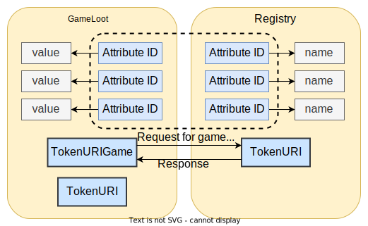
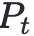
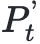
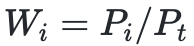
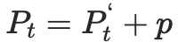
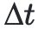
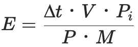

# Introduction

We will introduce the technical details of all Connexion smart contracts, including parts like FT, NFT, Treasury vaults and Marketplace. 


# ERC20 Token Contract
 
 Other than the basic functions of a Fungible Token, we also need to provide a one-click smart contract creation function. In order to realize this, we have developed three contracts, in the name of GameERC20Factory.sol, GameERC20Proxy.sol and GameERC20Token.sol. Their relationships are shown as below:

 

 For those who are unfamiliar with the delegatecall instruction, here is a simple explanation. Smart Contract A calls Smart Contract B via the delegatecall instruction, the transaction will execute according to the logics set by Contract B, however, the contexts of the execution and its status change are stored in Contract A. We call Contract A Proxy contract，Contract B Implementation contract. GameERC20Proxy is the Proxy contract, storing token status. Users are able to create any number of GameERC20Proxy cases via GameERCFactory, every case is a token. All tokens created by GameERC20Factory have the same implementation contract in GameERC20Token.

## GameERC20Factory

### Storage variable

#### vaultCount

```solidity
uint256 public vaultCount;
```

 Vaultcount represents the total generated token count

#### vaults

```solidity
mapping(uint256 => address) public vaults;
```

 Vaults store the address for the generated tokens

#### logic

```solidity
address public immutable logic;
```

 Logic is the logic contract address for all tokens. We use an unchangeable variable to store the logic contract addresses to make sure that the token logic address is the same for every token created by factory.


### Functions

#### Generate

```solidity
function generate(
    string memory _name,
    string memory _symbol,
    uint256 _cap
) external whenNotPaused returns (uint256 _index) {
    bytes memory _initializationCallData =
    abi.encodeWithSignature(
        "initialize(string,string,uint256,address)",
        _name,
        _symbol,
        _cap,
        msg.sender
    );

    address vault = address(
        new GameErc20Proxy(
            logic,
            _initializationCallData
        )
    );

    vaults[vaultCount] = vault;
    vaultCount++;

    return vaultCount - 1;
}
```

Generate is a function to create new token

Parameters:

Name | Type | Description
--------- | ------- | -----------
_name | string | token's name
_symbol | string | token's symbol
_cap | uint256 | token’s maximum amount

Return Values:

Name | Type | Description
--------- | ------- | -----------
_index | uint256 | token index number in the underlying set 

 
 
 


## GameErc20Proxy

### Storage variable

#### logic

```solidity
address public immutable logic;
```

 Logic is the logic contract address for all tokens. We use an unchangeable variable to store the logic contract address to make sure that the logic of the token cannot be changed. Upgradeable smart contracts are realized by changing logic contracts.

### Functions

#### fallback

```solidity
fallback() external payable {
    address _impl = logic;
    assembly {
        let ptr := mload(0x40)
        calldatacopy(ptr, 0, calldatasize())
        let result := delegatecall(gas(), _impl, ptr, calldatasize(), 0, 0)
        let size := returndatasize()
        returndatacopy(ptr, 0, size)
        switch result
            case 0 {
                revert(ptr, size)
            }
            default {
                return(ptr, size)
            }
    }
}
```

 fallback is an important function to realize proxy contracts. The concepts of a proxy contract is outlined in [EIP1167](https://github.com/ethereum/EIPs/blob/master/EIPS/eip-1167.md), with the following characteristics:

 1. Return true when successfully called, the returned data cannot be managed
 2. When the calling function does not exist in the proxy contract, the contract will call fallback function instead. We can set up the logic in fallback function to deal with such issues. Proxy contracts using a customized fallback function will redirect the call request to the logic contract.
 3. Every time when Contract A use delegatecall function to call Contract B, the transaction will be implemented in the context set up by contract A, using logics from Contract B. The transaction will keep the data msg.value and msg.sender in Contract A. Every alteration to the storage will affect Contract A. The status in Contract B will not be changed.

 We can also refer to the realization of Openzeppelin smart contract library via [Openzeppelin Proxy](https://github.com/OpenZeppelin/openzeppelin-labs/blob/master/upgradeability_using_eternal_storage/contracts/Proxy.sol).

## GameERC20Token

```solidity
function mint(address account, uint256 amount) public onlyOwner {
  if (totalSupply() + amount > cap)
      amount = cap - totalSupply();
  _mint(account, amount);
}
```

 The way for addresses with owner permission to mint  tokens. The total minted amount cannot exceed the default total supply.

Parameters:

Name | Type | Description
--------- | ------- | -----------
account | address | address receiving minted tokens
amount | uint256 | minted amount


# General multi-game NFT token Contract

 Loot was defined as the new paradigm for NFT. On the smart contract coding level, the innovation of loot rests in that it attempts to record the attributes of NFT on the decentralized system, resolving the problem for normal NFTs, which is that their metadata can be easily modified by their creators. On the artistic level, Loot intentionally omits images, allowing developers to fully use their imagination, portraying different images for the same Loot.

 Although Loot demonstrates significant improvements from traditional NFTs, it still has its weaknesses. The attribute types in Loot are quite limited, and concrete. For instance, “Warring Axe” is an attribute from the first generation of Loot. Though artists are able to freely design the visualization of Warring Axe, it can only be a Warring Axe. The imaginations of artistics are constrained into that specific object. 

 Inspired by Loot’s strengths and weaknesses, we made a new innovation, replacing the text attributes in Loot with numbers and unbounding the count of attributes in a single NFT. Thus the same NFT can act as different roles in different scripts, becoming a bridge connecting different game metaverses. 

 The meaning of NFT properties in each game world will be hosted by the Registry contract, and users can query the corresponding values on the chain. We will also provide the `TokenURIGame` function to generate an SVG containing the attribute name, let's take a look at the relationship between these two contracts:

 

 The Registry contract represents the data of a specific game. When a player wants to view the image of his NFT in a specific game, he can view it through the `TokenURIGame` method. TokenURI returns metadata that does not contain any game elements. In order to meet the EIP721 standard and ensure that it can be displayed normally on Opensea.

 For Connexion, we created a GameFi specific NFT Standard:[Non-fungible Token for GameFi](https://github.com/bnb-chain/BEPs/pull/129)。

## Storage variable

> Data structure to store properties

```solidity
struct AttributeBaseData {
    uint8 decimal;
    bool exist;
}

struct AttributeData {
    uint128 attrID;
    uint128 attrValue;
}

// attrID => decimal
mapping(uint128 => AttributeBaseData) internal _attrBaseData;
// tokenID => attribute data
mapping(uint256 => AttributeData[]) internal _attrData;
```

`AttributeBaseData` stores the precision of a single attribute, resolving the issue with decimals.

`AttributeData` stores the attribute ID and attribute value.

`_attrBaseData` is a key-value pair, key is the attribute ID, value is the attribute’s basic info (precision, created or not), used to search an attribute's precision.

`_attrData` is also a key-value pair, key is tokenID, value is the NFT’s attribute array.

## Functions

### tokenURI

> A method of displaying NFT attributes through SVG

```solidity
function tokenURI(uint256 tokenID) override public view returns (string memory) {
    AttributeData[] memory attrData = _attrData[tokenID];

    string memory output = '<svg xmlns="http://www.w3.org/2000/svg" preserveAspectRatio="xMinYMin meet" viewBox="0 0 350 350"><style>.base { fill: white; font-family: serif; font-size: 14px; }</style><rect width="100%" height="100%" fill="black" /><text x="10" y="20" class="base">ID</text><text x="80" y="20" class="base">Value</text><text x="185" y="20" class="base">ID</text><text x="255" y="20" class="base">Value';

    string memory p1 = '</text><text x="10" y="';
    string memory p2 = '</text><text x="80" y="';
    string memory p3 = '</text><text x="185" y="';
    string memory p4 = '</text><text x="255" y="';
    string memory p5 = '" class="base">';

    bytes memory tb;
    for (uint256 i; i < _attrData[tokenID].length; i++) {
        uint128 id = attrData[i].attrID;
        uint128 value = attrData[i].attrValue;
        if (i % 2 == 0) {
            string memory y = toString(40 + 20 * i / 2);
            tb = abi.encodePacked(tb, p1, y, p5, toString(id), p2, y, p5, toString(value));
        } else {
            string memory y = toString(40 + 20 * (i - 1) / 2);
            tb = abi.encodePacked(tb, p3, y, p5, toString(id), p4, y, p5, toString(value));
        }
    }
    tb = abi.encodePacked(tb, '</text></svg>');

    string memory json = Base64.encode(bytes(string(abi.encodePacked('{"name": "Bag #', toString(tokenID),
        '", "description": "GameLoot is a general NFT for games. Images, attribute name and other functionality are intentionally omitted for each game to interprets. You can use gameLoot as you like in a variety of games.", "image": "data:image/svg+xml;base64,',
        Base64.encode(abi.encodePacked(output, tb)), '"}'))));
    output = string(abi.encodePacked('data:application/json;base64,', json));

    return output;
}
```

 Similar to Loot, we use SVG to display an NFT’s attributes.
 
Parameters:

Name | Type | Description
--------- | ------- | -----------
tokenID | uint256 | NFT’s unique ID

Return Values:

Name | Type | Description
--------- | ------- | -----------
output | string | String value after Base64 conversion of the SVG data

### create

> Create a single property

```solidity
function create(uint128 attrID_, uint8 decimals_) override public onlyOwner {
    super.create(attrID_, decimals_);
}
```

 Only addresses with owner permission can create attributes, existing attributeID cannot be re-created.
 
Parameters:

Name | Type | Description
--------- | ------- | -----------
attrID_ | uint128 | NFT attribute’s unique ID
decimals_ | uint8 | precision of the attribute

### createBatch

> Create multiple properties

```solidity
function createBatch(uint128[] memory attrIDs_, uint8[] memory decimals_) override public onlyOwner {
    super.createBatch(attrIDs_, decimals_);
}
```

 Only addresses with owner permission can create attributes, existing attributeID cannot be re-created.
 
Parameters:

Name | Type | Description
--------- | ------- | -----------
attrIDs_ | uint128[] | NFT attribute’s unique ID arrays
decimals_ | uint8[] | precision of the attributes, correspondent to every attribute

### attach

> Add a single attribute to the NFT attribute list

```solidity
function attach(uint256 tokenID_, uint128 attrID_, uint128 value_) override public onlyTreasure {
    _attach(tokenID_, attrID_, value_);
}
```

 Add an attribute and its corresponding value to the NFT attributes list, only [treasure contract](#treasure-contract) have the permission to call this function
 
Parameters:

Name | Type | Description
--------- | ------- | -----------
tokenID_ | uint256 | NFT’s unique ID
attrID_ | uint128 | NFT attribute’s unique ID
value_ | uint128 | NFT attribute’s value

### attachBatch

> Add multiple attributes to NFT attribute list

```solidity
function attachBatch(uint256 tokenID_, uint128[] memory attrIDs_, uint128[] memory values_) override public onlyTreasure {
    _attachBatch(tokenID_, attrIDs_, values_);
}
```

 Add a batch of attributes and their corresponding values to the NFT attribute list, only [treasure contract](#treasure-contract) have the permission to call this function
 
Parameters:

Name | Type | Description
--------- | ------- | -----------
tokenID_ | uint256 | NFT’s unique ID
attrIDs_ | uint128[] | NFT attribute array’s unique ID
values_ | uint128[] | NFT attribute’s value array, corresponding to every attribute array’s unique ID

### remove

> Remove a single attribute from the NFT attribute list

```solidity
function remove(uint256 tokenID_, uint256 attrIndex_) override public onlyTreasure {
    _remove(tokenID_, attrIndex_);
}
```

 Removing attributes from the NFT attribute list via attribute index. If the index is beyond the attribute array’s range, this function will fail. Only [treasure contract](#treasure-contract) have the permission to call this function.
 
Parameters:

Name | Type | Description
--------- | ------- | -----------
tokenID_ | uint256 | NFT’s unique ID
attrIndex_ | uint256 | Attribute corresponding index in the NFT attribute list

### removeBatch

> Remove multiple attributes from NFT attribute list

```solidity
function removeBatch(uint256 tokenID_, uint256[] memory attrIndexes_) override public onlyTreasure {
    _removeBatch(tokenID_, attrIndexes_);
}
```

 Removing a batch of attributes from the NFT attribute list via multi attribute indexes. If the indexes are beyond the attribute array’s range, this function will fail. Only [treasure contract](#treasure-contract) can call this function.
 
Parameters:

Name | Type | Description
--------- | ------- | -----------
tokenID_ | uint256 | NFT’s unique ID
attrIndexes_ | uint256[] | Attribute corresponding index arrays in the NFT attribute list

### update

> Update the value of an NFT single property

```solidity
function update(uint256 tokenID_, uint256 attrIndex_, uint128 value_) override public onlyTreasure {
    _update(tokenID_, attrIndex_, value_);
}
```

 Updaing the value of an attribute via attribute index. If the index is beyond the attribute array’s range, this function will fail. Only [treasure contract](#treasure-contract) can call this function.
 
Parameters:

Name | Type | Description
--------- | ------- | -----------
tokenID_ | uint256 | NFT’s unique ID
attrIndex_ | uint256 | Attribute corresponding index in the NFT attribute list
value_ | uint128 | Updated value of the attribute

### updateBatch

> Update the values of multiple properties of an NFT

```solidity
function updateBatch(uint256 tokenID_, uint256[] memory attrIndexes_, uint128[] memory values_) override public onlyTreasure {
    _updateBatch(tokenID_, attrIndexes_, values_);
}
```

 Updating the value of multiple attributes via attribute indexes. If the indexes are beyond the attribute array’s range, this function will fail.  Only [treasure contract](#treasure-contract) can call this function.
 
Parameters:

Name | Type | Description
--------- | ------- | -----------
tokenID_ | uint256 | NFT’s unique ID
attrIndexes_ | uint256[] | Attribute corresponding index arrays in the NFT attribute list
values_ | uint128[] | set of updated values for the attribute array, corresponding to every attriIndexes_

# Treasure contract

> One of the ways to recover the signer using the ecrecover instruction

```solidity
function signatureWallet(
    address _wallet,
    address _this,
    address _token,
    uint256 _tokenID,
    uint256 _nonce,
    uint128[] memory _attrIDs,
    uint128[] memory _attrValues,
    uint256[] memory _attrIndexesUpdate,
    uint128[] memory _attrValuesUpdate,
    uint256[] memory _attrIndexesRMs,
    bytes memory _signature
) internal pure returns (address){
    bytes32 hash = keccak256(
        abi.encode(_wallet, _this, _token, _tokenID, _nonce, _attrIDs, _attrValues, _attrIndexesUpdate, _attrValuesUpdate, _attrIndexesRMs)
    );
    return ECDSA.recover(ECDSA.toEthSignedMessageHash(hash), _signature);
}
```

 Treasury contract is the interactive portal between the blockchain and the centralized game system, we will first take a look at the asset flow chart:

 
 
 All in-game asset (FT and NFT) deposits from the blockchain are realized through locking up the assets in the treasury contract; Similarly, all withdrawals from the game to the blockchains are realized through unlocking the assets in the treasury contract. The withdrawal flow chart is shown below:

 

 We are able to see that the users require signatures to realize valid withdrawal transactions. Signatures have two applications in the smart contract design; ecrecover command is used to recover the signature data of the signing addressing, thus verifying the validity of the signature; On the other hand, withdrawal method can be called by any parties, in order to guarantee that the transaction can be verified as expected, the signature machine will sign on the following data:

Signed Message | Description
--------- | -------
recipient address | to prevent a false address receiving the withdrawn assets from the treasury
treasury contract address | to prevent the signature from being used in another treasury
token contract address | guaratee that the signature can only withdraw one asset from the treasury
a non-repeated randomized number | guarantee that the signature can only be used once
FT amount | to control the withdrawn amount
NFT tokenID | to guarantee withdrawing the correct NFT
Updated attributes data for the NFT | to prevent users from changing the NFT attributes at will

## ERC20 Treasury Contract

### Functions

#### upChain

> Withdraw FT assets from the treasury contract, corresponding to game withdrawal

```solidity
function upChain(
    uint256 _amount,
    uint256 _nonce,
    bytes memory _signature
) public nonceNotUsed(_nonce) whenNotPaused {
    require(verify(msg.sender, address(this), token, _amount, _nonce, this.upChain.selector, _signature), "sign is not correct");
    usedNonce[_nonce] = true;

    IERC20(token).safeTransfer(msg.sender, _amount);
    emit UpChain(msg.sender, _amount, _nonce);
}
```

Parameters:

Name | Type | Description
--------- | ------- | -----------
_amount | uint256 | Token amount
_nonce | uint256 | a randomized number to verify if the signature has been used already
_signature | bytes | signature data returned by the signature machine

#### topUp

> Recharge and lock FT assets into the vault contract, corresponding to game recharge

```solidity
function topUp(
    uint256 _amount,
    uint256 _nonce
) public nonceNotUsed(_nonce) whenNotPaused {
    usedNonce[_nonce] = true;
    IERC20(token).safeTransferFrom(msg.sender, address(this), _amount);
    emit TopUp(msg.sender, _amount, _nonce);
}
```

Parameters:

Name | Type | Description
--------- | ------- | -----------
_amount | uint256 | Token amount
_nonce | uint256 | a randomized number to mark this deposit order

## ERC721 Treasury Contract

### Functions

#### upChain

> Withdraw NFT assets from the treasury contract, corresponding to game withdrawal

```solidity
function upChain(
    address _token,
    uint256 _tokenID,
    uint256 _nonce,
    uint128[] memory _attrIDs,
    uint128[] memory _attrValues,
    uint256[] memory _attrIndexesUpdate,
    uint128[] memory _attrValuesUpdate,
    uint256[] memory _attrIndexesRM,
    bytes memory _signature
) public whenNotPaused nonceNotUsed(_nonce) {
    require(msg.sender == lastOwner[_tokenID], "only person who topped up it");
    require(verify(msg.sender, address(this), _token, _tokenID, _nonce, _attrIDs, _attrValues, _attrIndexesUpdate, _attrValuesUpdate, _attrIndexesRM, _signature), "sign is not correct");
    usedNonce[_nonce] = true;
    if (_attrIDs.length != 0)
        IGameLoot(_token).attachBatch(_tokenID, _attrIDs, _attrValues);
    if (_attrIndexesUpdate.length != 0)
        IGameLoot(_token).updateBatch(_tokenID, _attrIndexesUpdate, _attrValuesUpdate);
    if (_attrIndexesRM.length != 0)
        IGameLoot(_token).removeBatch(_tokenID, _attrIndexesRM);
    lastOwner[_tokenID] = address(0);
    IERC721(_token).transferFrom(address(this), msg.sender, _tokenID);
    emit UpChain(msg.sender, _token, _tokenID, _nonce);
}
```

During the gaming process, the atrtibutes of certain gears will change based on player’s action, thus when withdrawing, we need to update the status of the attributes onto the blockchain.

Parameters:

Name | Type | Description
--------- | ------- | -----------
_token | address | withdrawn NFT token address
_tokenID | uint256 | withdrawn NFT tokenID
_nonce | uint256 | a randomized number to mark the signature and verify if it has been used
_attrIDs | uint128[] | new attribute IDs array
_attrValues | uint128[] | new attributes values corresponding to the IDs array
_attrIndexesUpdate | uint256[] | attribute index arrays that require updates
_attrValuesUpdate | uint128[] | updated value for the attribute index arrays
_attrIndexesRM | uint256[] | attribute index arrays to be removed
_signature | bytes | signature data returned by the signature machine

#### topUp

> Recharge and lock NFT assets into the vault contract, corresponding to the recharge of the game

```solidity
function topUp(
    address _token,
    uint256 _tokenID,
    uint256 _nonce
) public whenNotPaused nonceNotUsed(_nonce) {
    usedNonce[_nonce] = true;

    lastOwner[_tokenID] = msg.sender;
    IERC721(_token).transferFrom(msg.sender, address(this), _tokenID);
    emit TopUp(msg.sender, _token, _tokenID, _nonce);
}
```

Parameters:

Name | Type | Description
--------- | ------- | -----------
_token | address | Depositing NFT’s token address
_tokenID | uint256 | Depositing NFT’s tokenID
_nonce | uint256 | a randomized number to mark this deposit order

# Marketplace Contract

## Functions

### createPool

> Create a sell order

```solidity
function createPool(
    // address of token0
    address token0,
    // address of token1
    address token1,
    // token id of token0
    uint256 tokenId,
    // total amount of token1
    uint256 amountTotal1,
    // duration time
    uint256 duration
) external payable {
    require(!getDisableErc721(), "ERC721 pool is disabled");
    if (checkToken0) {
        require(token0List[token0], "invalid token0");
    }
    uint256 amountTotal0 = 1;
    _create(
        token0, token1, tokenId, amountTotal0, amountTotal1,
        duration
    );
}
```

Parameters:

Name | Type | Description
--------- | ------- | -----------
token0 | address | selling NFT’s token contract address
token1 | address | receiving crypto currency’s token address
tokenId | uint256 | selling NFT’s tokenID
amountTotal1 | uint256 | price, expected amount of token1
duration | uint256 | duration of the sell order

### swap

> Exchange the corresponding NFT

```solidity
function swap(uint256 index) external payable
    isPoolExist(index)
    isPoolNotClosed(index)
    isPoolNotSwap(index)
{
    Pool storage pool = pools[index];

    // mark pool is swapped
    swappedP[index] = true;

    uint256 txFee = pool.amountTotal1 * getTxFeeRatio() / (1 ether);
    uint256 _actualAmount1 = pool.amountTotal1 - txFee;
    // transfer amount of token1 to creator
    if (pool.token1 == address(0)) {
        require(pool.amountTotal1 <= msg.value, "invalid ETH amount");

        if (_actualAmount1 > 0) {
            // transfer ETH to creator
            pool.creator.transfer(_actualAmount1);
        }
        if (txFee > 0) {
            // transaction fee to fee account
            payable(getFeeAccount()).transfer(txFee);
        }
    } else {
        IERC20Upgradeable(pool.token1).safeTransferFrom(msg.sender, address(this), pool.amountTotal1);
        // transfer token1 to creator
        IERC20Upgradeable(pool.token1).safeTransfer(pool.creator, _actualAmount1);
        IERC20Upgradeable(pool.token1).safeTransfer(getFeeAccount(), txFee);
    }

    // transfer tokenId of token0 to sender
    IERC721Upgradeable(pool.token0).safeTransferFrom(address(this), msg.sender, pool.tokenId);

    emit Swapped(msg.sender, index, pool.amountTotal0);
}
```

Parameters:

Name | Type | Description
--------- | ------- | -----------
index | uint256 | NFT sell order’s index in the sell order pool

# Stake and Farm Contract

Staking rewards are distributed uniformly with the generated blocks. Every time a new block is generated, fixed amount of token rewards will be distributed. Simultaneously, there will be multiple pools in a single contract, every pool is generated to have different weights. The rewards are weighted by the pools and distributed accordingly.

## What are the important data in the smart contract?

The most important data are the pools and their users’ information

### Pool Info

Let’s look at the smart contract code on the right.

> The data structure that stores the Pool in the contract.

```solidity
struct PoolInfo {
	IERC20 lpToken; // Address of LP token contract.
	uint256 allocPoint; // How many allocation points assigned to this pool. Tokens to distribute per block.
	uint256 lastRewardBlock; // Last block number that Tokens distribution occurs.
	uint256 accTokenPerShare; // Accumulated Tokens per share, times 1e12. See below.
}
```

Parameters:

|Name|Description|
|--|--|
|lpToken|Token contract address of the token|
|allocPoint|allocation points assigned to the pool|
|lastRewardBlock|last block number that Tokens distribution occurs|
|accTokenPerShare|accumulated Tokens reward per share of staked token|

### User Info

The relationships between user and the staking pool are as such:
**PoolID -> user address -> User’s Info in the pool**

corresponding to the following smart contract coding:

> Pool and user data mapping relationship

```solidity
mapping(uint256 => mapping(address => UserInfo)) public userInfo;
```

Therefore we can see that user info is marked by pool. Let’s take a look at the `UserInfo` coding on the right:

> User Information Data Structure

```solidity
struct UserInfo {
	uint256 amount; // How many tokens the user has provided.
	uint256 rewardDebt; // Reward debt. See explanation below.
}
```

Parameters:

|Name|Description|
|--|--|
|amount|amount of tokens the user staked|
|rewardDebt|reward debt, or rewards that have been drawn|

We will take a look at the reward calculation method to demonstrate how these parameters work.

## Pool weight calculation

Suppose:

* Total Weight Points: 
* Past Total Weight Points: 
* Weight of Pool ***i***: 
* Weight Points of Pool ***i***: 
* New Weight Points added to the pool: 

Calculation of Weight of Pool ***i*** :


When a new Pool is added, change to total Weight Points: 


Thus we can tell that whenever a new pool is added, the weights of all existing pools are diluted.

## Reward calculation

Pool rewards are calculated by share and reward per share: 

`Reward = Shares * Reward per share`

As new blocks are constantly generated, ***reward per share***will increase. Because the stake and farm rewarding mechanism lies in distributing fixed amount of tokens every new block.

When do we update the***reward per share***? This is where the cleverness of smart contract design lies: we update the reward per share only when user stake or withdraw.

Let’s take a look at the code on updating ***reward per share***, the explanation is written in the code:

```solidity
function updatePool(uint256 _pid) public {
	// 1. Get Pool information
	PoolInfo storage pool = poolInfo[_pid];
	if (block.number <= pool.lastRewardBlock) {
		return;
	}
	uint256 lpSupply = pool.lpToken.balanceOf(address(this));
	if (lpSupply == 0) {
		pool.lastRewardBlock = block.number;
		return;
	}
	// 2. Get the number of blocks since the last update of reward per share 
	uint256 multiplier = getMultiplier(pool.lastRewardBlock, block.number);
	// 3. Calculate the total Token reward of this Pool according to the number of blocks, the speed of reward issuance, and the weight of the Pool
	uint256 tokenReward =
		multiplier.mul(tokenPerBlock).mul(pool.allocPoint).div(
			totalAllocPoint
		);
	token.mint(devaddr, tokenReward.div(10));
	token.mint(address(this), tokenReward);
	// 4. Calculate and update reward per share based on total rewards
	pool.accTokenPerShare = pool.accTokenPerShare.add(
		tokenReward.mul(1e12).div(lpSupply)
	);
	pool.lastRewardBlock = block.number;
}
```

Parameter _pid is the PoolID.

The calculation of ***reward per share***is shown below:

Suppose:

* Reward Distribution Velocity: 

* block gap since last settlement: 

* Total Weight Points: 
* Weight Points of Pool ***i***: 
* Total Staked Amount: 
* Earnings per share: 

Calculation of earning per share for pool ***i***:


Because earning per share is constantly increasing, we need to use variable `rewardDebt` to record the amount of rewards that the user has drawn. The total reward minus `rewardDebt` will be the current claimable rewards.

# Timelock Smart Contract

## The Purpose of a timelock contract

The purpose of a timelock contract is to control the owner permission to some degrees. When the owners are to conduct an operation, he can notify the users in advance, and write the to-be-called transaction data in the transaction queue of a timelock contract. The users will be able to read what the owner is about to do, judge whether the owner’s action will bring significant risks or not, and make their decisions accordingly within the timespan of the timelock.

## Primary functions and steps

There are usually three main function in a timelock contract:

1. Setting the transaction execution time;
2. Execute the transaction in the valid timeframe;
3. Cancel the transaction anytime between set up till execution

### Setting up transaction

When the owner is about to conduct a transaction, he can notify all users by setting up the transaction, informing on when, how, and what about the transaction. On the coding level, setting up a transaction is equivalent to marking a transaction as pending status. Please refer to the right:

> Set transaction function code

```solidity
function queueTransaction(
	address target,
	uint256 value,
	string memory signature,
	bytes memory data,
	uint256 eta
) public returns (bytes32) {
	require(msg.sender == admin, "Timelock::queueTransaction: Call must come from admin.");
	require(eta >= getBlockTimestamp().add(delay), "Timelock::queueTransaction: Estimated execution block must satisfy delay.");
	bytes32 txHash = keccak256(abi.encode(target, value, signature, data, eta));
	// marked as pending
	queuedTransactions[txHash] = true;
	emit QueueTransaction(txHash, target, value, signature, data, eta);
	return txHash;
}
```

Parameters:

|Name|Description|
|--|--|
|target|the target to-be-called contract address|
|value|amount of Eth for this transaction|
|signature|function signature|
|data|calldata that was encoded|
|eta|timestamp to unlock the transaction|

Callback:

|Name|Description|
|--|--|
|bytes32|marking of this transaction in the timelock contract|

<aside class="notice">
Note⚠️：The callback value is not a transaction hash, because eta is not transaction data.
</aside>

### Cancel transaction

Cancel transaction is changing the status of the pending transaction, please refer to the right:

> Cancel transaction code

```solidity
function cancelTransaction(
	address target,
	uint256 value,
	string memory signature,
	bytes memory data,
	uint256 eta
) public {
	require(msg.sender == admin, "Timelock::cancelTransaction: Call must come from admin.");
	bytes32 txHash = keccak256(abi.encode(target, value, signature, data, eta));
	queuedTransactions[txHash] = false;
	emit CancelTransaction(txHash, target, value, signature, data, eta);
}
```

参数解释：

|Name|Description|
|--|--|
|target|the target to-be-called contract address|
|value|amount of Eth for this transaction|
|signature|function signature|
|data|calldata that was encoded|
|eta|timestamp to unlock the transaction|

### Execute Transaction

Use the timelock contract to execute target contract. Will need to call target contract, please refer to the right:

> execute transaction code

```solidity
function executeTransaction(
	address target,
	uint256 value,
	string memory signature,
	bytes memory data,
	uint256 eta
) public payable returns (bytes memory) {
	require(msg.sender == admin, "Timelock::executeTransaction: Call must come from admin.");
	bytes32 txHash = keccak256(abi.encode(target, value, signature, data, eta));
	require(queuedTransactions[txHash], "Timelock::executeTransaction: Transaction hasn't been queued.");
	require(getBlockTimestamp() >= eta, "Timelock::executeTransaction: Transaction hasn't surpassed time lock.");
	require(getBlockTimestamp() <= eta.add(GRACE_PERIOD), "Timelock::executeTransaction: Transaction is stale.");
	queuedTransactions[txHash] = false;
	bytes memory callData;
	if (bytes(signature).length == 0) {
		callData = data;
	} else {
		callData = abi.encodePacked(bytes4(keccak256(bytes(signature))), data);
	}
	(bool success, bytes memory returnData) = target.call{value: value}(callData);
	require(success, "Timelock::executeTransaction: Transaction execution reverted.");
	emit ExecuteTransaction(txHash, target, value, signature, data, eta);
	return returnData;
}
```

Parameters:

|Name|Description|
|--|--|
|target|the target to-be-called contract address|
|value|amount of Eth for this transaction|
|signature|function signature|
|data|calldata that was encoded|
|eta|timestamp to unlock the transaction|

Callback:

|Name|Description|
|--|--|
|bytes|The callback message from calling target contract|

All contracts granting call permission to the this contract can use timelock functions. All three above mentioned step can only be called by project owners.

# Smart Contract Security

## Source of Smart Contract

All contract-dependent libraries come from [Openzepplin](https://docs.openzeppelin.com/contracts/4.x/). Openzepplin was long audited by multiple institutions, it was proven safe. The following is a list of projects trusting Openzepplin:


Oppenzepplin has also conducted security auditing report for multiple institutions, including but not limited to:


## Permission Separation

Among the smart contracts, some requires immediate managing, such as immediate shut down permission, others, like parameters set up of a smart contract, are not that time-sensitive.

For safety purpose, we designate two permission roles with different addresses: `controller` and `owner`.

Owners have higher authority, their permissions are as follow:

* Setting up or changing controller
* Adding or removing address of the signature machine
* Unlocking ETH in the contract

Controllers have following permissions:

* Temporarily suspend deposit and withdraw functions of the smart contract

Owners are responsible for initialize parameters in the beginning of developing a smart contract; controllers work with the risk control system, shutting down deposit and withdraw functions in case of emergency to prevent significant loss.

## Others

In the [NFT treasure contract](#treasure-contract), the depositing transaction will record the address of the depositor, only the depositor has the permission to withdraw corresponding NFT. Such design ensures on the contract level that the NFT will not be falsely withdrawn and transferred.
