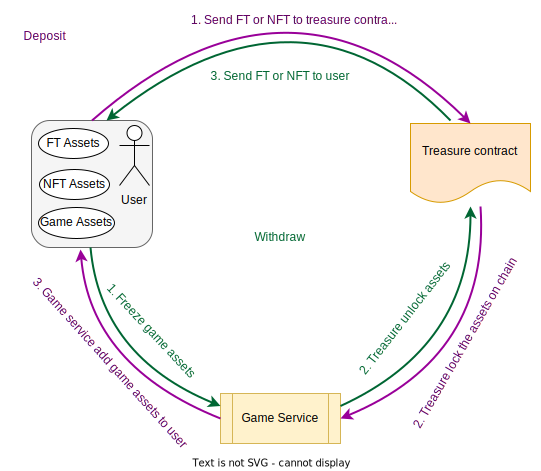

# Introduction

这里将会介绍Connexion所有合约的技术细节。其中包括FT、NFT、Treasure和Market几部分内容。

# ERC20 Token Contract
 
 Other than the basic functions of a Fungible Token, we also need to provide a one-click smart contract creation function. In order to realize this, we have developed three contracts, in the name of `GameERC20Factory.sol`, `GameERC20Proxy.sol` and `GameERC20Token.sol`. Their relationships are shown as below:

 

 For those who are unfamiliar with the delegatecall instruction, here is a simple explanation. Smart Contract A calls Smart Contract B via the delegatecall instruction, the transaction will execute according to the logics set by Contract B, however, the contexts of the execution and its status change are stored in Contract A. We call Contract A Proxy contract，Contract B Implementation contract. GameERC20Proxy is the Proxy contract, storing token status. Users are able to create any number of GameERC20Proxy cases via GameERCFactory, every case is a token. All tokens created by GameERC20Factory have the same implementation contract in GameERC20Token.

## GameERC20Factory

### Storage variable

#### vaultCount

```solidity
uint256 public vaultCount;
```

 vaultCount表示已经创建的token总数

#### vaults

```solidity
mapping(uint256 => address) public vaults;
```

 vaults存储已经创建的token地址

#### logic

```solidity
address public immutable logic;
```

 logic是所有代币的逻辑合约地址，使用不可变的变量存储逻辑合约地址保证每个工厂创建出来的代币逻辑合约都是一样的。

### Functions

#### Generate

```solidity
function generate(
    string memory _name,
    string memory _symbol,
    uint256 _cap
) external whenNotPaused returns (uint256 _index) {
    bytes memory _initializationCallData =
    abi.encodeWithSignature(
        "initialize(string,string,uint256,address)",
        _name,
        _symbol,
        _cap,
        msg.sender
    );

    address vault = address(
        new GameErc20Proxy(
            logic,
            _initializationCallData
        )
    );

    vaults[vaultCount] = vault;
    vaultCount++;

    return vaultCount - 1;
}
```

Generate is a function to create new token

Parameters:

Name | Type | Description
--------- | ------- | -----------
_name | string | token's name
_symbol | string | token's symbol
_cap | uint256 | token’s maximum amount

Return Values:

Name | Type | Description
--------- | ------- | -----------
_index | uint256 | token index number in the underlying set 

 
 
 
 
 
 
 
 
 
 

## GameErc20Proxy

### Storage variable

#### logic

```solidity
address public immutable logic;
```

 logic是所有代币的逻辑合约地址，使用不可变的变量存储逻辑合约地址保证token的合约逻辑不可以更改，可升级的合约就是通过改变logic合约实现的。

### Functions

#### fallback

```solidity
fallback() external payable {
    address _impl = logic;
    assembly {
        let ptr := mload(0x40)
        calldatacopy(ptr, 0, calldatasize())
        let result := delegatecall(gas(), _impl, ptr, calldatasize(), 0, 0)
        let size := returndatasize()
        returndatacopy(ptr, 0, size)
        switch result
            case 0 {
                revert(ptr, size)
            }
            default {
                return(ptr, size)
            }
    }
}
```

 fallback是实现代理合约的关键函数，代理合约的概念是在[EIP1167协议](https://github.com/ethereum/EIPs/blob/master/EIPS/eip-1167.md)中产生，有如下几个特性：

 1. 调用成功后返回true，无法管理返回的数据；
 2. 当调用的方法在代理合约中不存在时，合约会调用`fallback`函数。可以编写`fallback`函数的逻辑处理这种情况。代理合约使用自定义的`fallback`函数将调用请求重定向到逻辑合同中。
 3. 每当合约A将调用代理到另一个合同B时，它都会在合约A的上下文中执行合约B的代码。这意味着将保留msg.value和msg.sender值，并且每次存储修改都会影响合约A。

 也可以参考Openzipplin的合约库具体实现[Openzeppelin Proxy](https://github.com/OpenZeppelin/openzeppelin-labs/blob/master/upgradeability_using_eternal_storage/contracts/Proxy.sol)

## GameERC20Token

```solidity
function mint(address account, uint256 amount) public onlyOwner {
  if (totalSupply() + amount > cap)
      amount = cap - totalSupply();
  _mint(account, amount);
}
```

 拥有owner权限的地址铸造代币的方法，铸造的总数量将不可以超过预设的总供应量

Parameters:

Name | Type | Description
--------- | ------- | -----------
account | address | 接收铸造代币的地址
amount | uint256 | 铸造的数量


# 多游戏通用的 NFT token contract

 Loot曾经被定义为NFT的新范式。在合约代码层面，Loot的创新在于它将NFT的属性写在去中心化系统上，很好的解决了传统NFT的Metadata可以被开发者随意变更的问题。在形象艺术方面，Loot刻意将图片省略，使得不同的作者可以各自发挥想象力，用不同的画面来描述同一个Loot。

 虽然Loot相较于传统NFT有了很大的进步，但是Loot也有一些不足。Loot的属性种类十分有限，也十分具体。举个例子：第一代Loot中有一个属性是“战斧”，尽管画家们可以任意设计“战斧”的形象，但是它只能是战斧，这样就将画家们的想象力禁锢在这一件事物中。

 我们基于Loot的优缺点，做了进一步的创新，使用数字来代替Loot中的文字属性，并且单个NFT拥有属性的数量将不再受限制。这样，同一个NFT将可以在不同的故事剧本中成为完全不一样的角色，也为成为不同游戏世界的互通的桥梁。

 关于connecxion的NFT，我们创建了一个适用于GameFi的NFT新协议[Non-fungible Token for GameFi](https://github.com/bnb-chain/BEPs/pull/129)。

## Storage variable

> 存储属性的数据结构

```solidity
struct AttributeBaseData {
    uint8 decimal;
    bool exist;
}

struct AttributeData {
    uint128 attrID;
    uint128 attrValue;
}

// attrID => decimal
mapping(uint128 => AttributeBaseData) internal _attrBaseData;
// tokenID => attribute data
mapping(uint256 => AttributeData[]) internal _attrData;
```

`AttributeBaseData`存储的是单个属性的精度，为了解决小数问题。

`AttributeData`存储的是属性ID和属性值

`_attrBaseData`是一个键值对，key为属性ID，值为属性的基础数据（精度、是否被创建），用来查询属性的精度

`_attrData`也是一个键值对，key为tokenID，值为此NFT具有的属性数组

## Functions

### tokenURI

> 通过SVG展示NFT属性的方法

```solidity
function tokenURI(uint256 tokenID) override public view returns (string memory) {
    AttributeData[] memory attrData = _attrData[tokenID];

    string memory output = '<svg xmlns="http://www.w3.org/2000/svg" preserveAspectRatio="xMinYMin meet" viewBox="0 0 350 350"><style>.base { fill: white; font-family: serif; font-size: 14px; }</style><rect width="100%" height="100%" fill="black" /><text x="10" y="20" class="base">ID</text><text x="80" y="20" class="base">Value</text><text x="185" y="20" class="base">ID</text><text x="255" y="20" class="base">Value';

    string memory p1 = '</text><text x="10" y="';
    string memory p2 = '</text><text x="80" y="';
    string memory p3 = '</text><text x="185" y="';
    string memory p4 = '</text><text x="255" y="';
    string memory p5 = '" class="base">';

    bytes memory tb;
    for (uint256 i; i < _attrData[tokenID].length; i++) {
        uint128 id = attrData[i].attrID;
        uint128 value = attrData[i].attrValue;
        if (i % 2 == 0) {
            string memory y = toString(40 + 20 * i / 2);
            tb = abi.encodePacked(tb, p1, y, p5, toString(id), p2, y, p5, toString(value));
        } else {
            string memory y = toString(40 + 20 * (i - 1) / 2);
            tb = abi.encodePacked(tb, p3, y, p5, toString(id), p4, y, p5, toString(value));
        }
    }
    tb = abi.encodePacked(tb, '</text></svg>');

    string memory json = Base64.encode(bytes(string(abi.encodePacked('{"name": "Bag #', toString(tokenID),
        '", "description": "GameLoot is a general NFT for games. Images, attribute name and other functionality are intentionally omitted for each game to interprets. You can use gameLoot as you like in a variety of games.", "image": "data:image/svg+xml;base64,',
        Base64.encode(abi.encodePacked(output, tb)), '"}'))));
    output = string(abi.encodePacked('data:application/json;base64,', json));

    return output;
}
```

 这里同样采用Loot的方式，使用SVG展示NFT的属性。
 
Parameters:

Name | Type | Description
--------- | ------- | -----------
tokenID | uint256 | NFT 的唯一标识

Return Values:

Name | Type | Description
--------- | ------- | -----------
output | string | SVG数据经过Base64编码后的数据

### create

> 创建单个属性

```solidity
function create(uint128 attrID_, uint8 decimals_) override public onlyOwner {
    super.create(attrID_, decimals_);
}
```

 只有owner拥有属性的创建权限，已经存在的属性ID不可以被再次创建。
 
Parameters:

Name | Type | Description
--------- | ------- | -----------
attrID_ | uint128 | NFT属性的唯一标识
decimals_ | uint8 | 属性的精度

### createBatch

> 创建多个属性

```solidity
function createBatch(uint128[] memory attrIDs_, uint8[] memory decimals_) override public onlyOwner {
    super.createBatch(attrIDs_, decimals_);
}
```

 只有owner拥有属性的创建权限，已经存在的属性ID不可以被再次创建。
 
Parameters:

Name | Type | Description
--------- | ------- | -----------
attrIDs_ | uint128[] | NFT属性的唯一标识数组
decimals_ | uint8[] | 属性的精度数组，每个元素的下标与attrIDs_的元素一一对应

### attach

> 将单个属性添加到NFT属性列表中

```solidity
function attach(uint256 tokenID_, uint128 attrID_, uint128 value_) override public onlyTreasure {
    _attach(tokenID_, attrID_, value_);
}
```

 将某一个属性和对应的值添加到NFT属性列表中，只有[treasure合约](#金库合约)才拥有调用此方法的权限。
 
Parameters:

Name | Type | Description
--------- | ------- | -----------
tokenID_ | uint256 | NFT 的唯一标识
attrID_ | uint128 | NFT属性的唯一标识
value_ | uint128 | NFT属性的值

### attachBatch

> 将多个属性添加到NFT属性列表中

```solidity
function attachBatch(uint256 tokenID_, uint128[] memory attrIDs_, uint128[] memory values_) override public onlyTreasure {
    _attachBatch(tokenID_, attrIDs_, values_);
}
```

 将某多个属性和对应的值添加到NFT属性列表中，只有[treasure合约](#金库合约)才拥有调用此方法的权限。
 
Parameters:

Name | Type | Description
--------- | ------- | -----------
tokenID_ | uint256 | NFT 的唯一标识
attrIDs_ | uint128[] | NFT属性的唯一标识数组
values_ | uint128[] | NFT属性值数组，每个元素下标与attrIDs_元素的对应

### remove

> 将单个属性从NFT属性列表中移除

```solidity
function remove(uint256 tokenID_, uint256 attrIndex_) override public onlyTreasure {
    _remove(tokenID_, attrIndex_);
}
```

 通过属性的下标，将对应的属性从NFT属性列表中移除，若下标超出属性数组范围，交易会执行失败，只有[treasure合约](#金库合约)才拥有调用此方法的权限。
 
Parameters:

Name | Type | Description
--------- | ------- | -----------
tokenID_ | uint256 | NFT 的唯一标识
attrIndex_ | uint256 | 对应属性在NFT属性列表中的下标

### removeBatch

> 将多个属性从NFT属性列表中移除

```solidity
function removeBatch(uint256 tokenID_, uint256[] memory attrIndexes_) override public onlyTreasure {
    _removeBatch(tokenID_, attrIndexes_);
}
```

 通过多个属性的下标，将对应的属性从NFT属性列表中移除，若下标超出属性数组范围，交易会执行失败，只有[treasure合约](#金库合约)才拥有调用此方法的权限。
 
Parameters:

Name | Type | Description
--------- | ------- | -----------
tokenID_ | uint256 | NFT 的唯一标识
attrIndexes_ | uint256[] | 对应属性在NFT属性列表中的下标数组

### update

> 更新NFT单个属性的值

```solidity
function update(uint256 tokenID_, uint256 attrIndex_, uint128 value_) override public onlyTreasure {
    _update(tokenID_, attrIndex_, value_);
}
```

 通过属性的下标，将对应的属性的值更新，若下标超出属性数组范围，交易会执行失败，只有[treasure合约](#金库合约)才拥有调用此方法的权限。
 
Parameters:

Name | Type | Description
--------- | ------- | -----------
tokenID_ | uint256 | NFT 的唯一标识
attrIndex_ | uint256 | 对应属性在NFT属性列表中的下标
value_ | uint128 | 需要设置的对应属性的新值

### updateBatch

> 更新NFT多个属性的值

```solidity
function updateBatch(uint256 tokenID_, uint256[] memory attrIndexes_, uint128[] memory values_) override public onlyTreasure {
    _updateBatch(tokenID_, attrIndexes_, values_);
}
```

 通过属性的下标，将多个属性的值更新，若下标超出属性数组范围，交易会执行失败，只有[treasure合约](#金库合约)才拥有调用此方法的权限。
 
Parameters:

Name | Type | Description
--------- | ------- | -----------
tokenID_ | uint256 | NFT 的唯一标识
attrIndexes_ | uint256[] | 对应属性在NFT属性列表中的下标数组
values_ | uint128[] | 需要设置的对应属性的新值集合，每个元素下标与attrIndexes_元素的对应

# 金库合约

> 其中一个使用ecrecover指令恢复签名者的方法

```solidity
function signatureWallet(
    address _wallet,
    address _this,
    address _token,
    uint256 _tokenID,
    uint256 _nonce,
    uint128[] memory _attrIDs,
    uint128[] memory _attrValues,
    uint256[] memory _attrIndexesUpdate,
    uint128[] memory _attrValuesUpdate,
    uint256[] memory _attrIndexesRMs,
    bytes memory _signature
) internal pure returns (address){
    bytes32 hash = keccak256(
        abi.encode(_wallet, _this, _token, _tokenID, _nonce, _attrIDs, _attrValues, _attrIndexesUpdate, _attrValuesUpdate, _attrIndexesRMs)
    );
    return ECDSA.recover(ECDSA.toEthSignedMessageHash(hash), _signature);
}
```

 金库合约是区块链系统与中心化游戏系统交互的关口，先来看看资产流动关系图：

 
 
 所有从区块链上充值到游戏内部的资产(包括FT和NFT)都是通过将资产锁定在treasure合约中来实现的；同样的，所有从游戏内部提现的资产也是通过解锁treasure合约中的资产来实现的。提现流程图如下：

 

 从图中可以看出，用户需要签名才可以发出有效提现交易。签名在合约中的应用有两方面：ecrecover指令可以恢复签名数据的签名者地址，这样就能验证签名数据的真伪；另外，提现方法是可以被任何用户调用的，为了保证交易可以符合预期地被确认，签名机会对如下数据进行签名：

Signed Message | Description
--------- | ------- 
接收者地址 | 为了防止错误的地址接收到从treasure合约提现出的资产
金库合约地址 | 为了防止签名在另一个金库合约重用
代币合约地址 | 确定此签名只能够从treasure合约中转移出一种资产
不重复的随机数 | 确保此签名只能够使用一次
FT的数量 | 用来控制提现出的金额
NFT的tokenID | 用来确保将正确的NFT提出
NFT属性更新后的数据 | 为了防止用户随意更改NFT属性

## ERC20 金库合约

### Functions

#### upChain

> 将FT资产从金库合约提出，对应游戏提现

```solidity
function upChain(
    uint256 _amount,
    uint256 _nonce,
    bytes memory _signature
) public nonceNotUsed(_nonce) whenNotPaused {
    require(verify(msg.sender, address(this), token, _amount, _nonce, this.upChain.selector, _signature), "sign is not correct");
    usedNonce[_nonce] = true;

    IERC20(token).safeTransfer(msg.sender, _amount);
    emit UpChain(msg.sender, _amount, _nonce);
}
```

Parameters:

Name | Type | Description
--------- | ------- | -----------
_amount | uint256 | 代币数量
_nonce | uint256 | 随机数，用来标识此签名是否已经被使用
_signature | bytes | 签名机返回的签名数据

#### topUp

> 将FT资产充值并锁定到金库合约中，对应游戏充值

```solidity
function topUp(
    uint256 _amount,
    uint256 _nonce
) public nonceNotUsed(_nonce) whenNotPaused {
    usedNonce[_nonce] = true;
    IERC20(token).safeTransferFrom(msg.sender, address(this), _amount);
    emit TopUp(msg.sender, _amount, _nonce);
}
```

Parameters:

Name | Type | Description
--------- | ------- | -----------
_amount | uint256 | 代币数量
_nonce | uint256 | 随机数，用来标识此次充值订单

## ERC721 金库合约

### Functions

#### upChain

> 将NFT资产从金库合约提出，对应游戏提现

```solidity
function upChain(
    address _token,
    uint256 _tokenID,
    uint256 _nonce,
    uint128[] memory _attrIDs,
    uint128[] memory _attrValues,
    uint256[] memory _attrIndexesUpdate,
    uint128[] memory _attrValuesUpdate,
    uint256[] memory _attrIndexesRM,
    bytes memory _signature
) public whenNotPaused nonceNotUsed(_nonce) {
    require(msg.sender == lastOwner[_tokenID], "only person who topped up it");
    require(verify(msg.sender, address(this), _token, _tokenID, _nonce, _attrIDs, _attrValues, _attrIndexesUpdate, _attrValuesUpdate, _attrIndexesRM, _signature), "sign is not correct");
    usedNonce[_nonce] = true;
    if (_attrIDs.length != 0)
        IGameLoot(_token).attachBatch(_tokenID, _attrIDs, _attrValues);
    if (_attrIndexesUpdate.length != 0)
        IGameLoot(_token).updateBatch(_tokenID, _attrIndexesUpdate, _attrValuesUpdate);
    if (_attrIndexesRM.length != 0)
        IGameLoot(_token).removeBatch(_tokenID, _attrIndexesRM);
    lastOwner[_tokenID] = address(0);
    IERC721(_token).transferFrom(address(this), msg.sender, _tokenID);
    emit UpChain(msg.sender, _token, _tokenID, _nonce);
}
```

在游戏进行过程中，装备属性会随着玩家的行为而发生改变，提现的时候，需要将属性状态的更改同步到区块链系统中

Parameters:

Name | Type | Description
--------- | ------- | -----------
_token | address | 提现的NFT地址
_tokenID | uint256 | 被提的装备ID
_nonce | uint256 | 随机数，用来标识此签名是否已经被使用
_attrIDs | uint128[] | 新增的属性ID数组
_attrValues | uint128[] | 新增属性ID对应的值的数组
_attrIndexesUpdate | uint256[] | 要更新的属性index数组
_attrValuesUpdate | uint128[] | 更新属性index对应的值的数组
_attrIndexesRM | uint256[] | 要被删除的属性index数组
_signature | bytes | 签名机返回的签名数据

#### topUp

> 将NFT资产充值并锁定到金库合约中，对应游戏的充值

```solidity
function topUp(
    address _token,
    uint256 _tokenID,
    uint256 _nonce
) public whenNotPaused nonceNotUsed(_nonce) {
    usedNonce[_nonce] = true;

    lastOwner[_tokenID] = msg.sender;
    IERC721(_token).transferFrom(msg.sender, address(this), _tokenID);
    emit TopUp(msg.sender, _token, _tokenID, _nonce);
}
```

Parameters:

Name | Type | Description
--------- | ------- | -----------
_token | address | 被提现的NFT地址
_tokenID | uint256 | 被提现的NFT的TokenID
_nonce | uint256 | 随机数，用来标识此次充值订单

# 交易市场合约

## Functions

### createPool

> 创建出售单

```solidity
function createPool(
    // address of token0
    address token0,
    // address of token1
    address token1,
    // token id of token0
    uint256 tokenId,
    // total amount of token1
    uint256 amountTotal1,
    // duration time
    uint256 duration
) external payable {
    require(!getDisableErc721(), "ERC721 pool is disabled");
    if (checkToken0) {
        require(token0List[token0], "invalid token0");
    }
    uint256 amountTotal0 = 1;
    _create(
        token0, token1, tokenId, amountTotal0, amountTotal1,
        duration
    );
}
```

Parameters:

Name | Type | Description
--------- | ------- | -----------
token0 | address | 出售的NFT合约地址
token1 | address | 要接收的token地址
tokenId | uint256 | 要卖出的NFT的TokenID
amountTotal1 | uint256 | 价格，期望收到token1的数量
duration | uint256 | 此卖单有效时间

### swap

> 交换对应的NFT

```solidity
function swap(uint256 index) external payable
    isPoolExist(index)
    isPoolNotClosed(index)
    isPoolNotSwap(index)
{
    Pool storage pool = pools[index];

    // mark pool is swapped
    swappedP[index] = true;

    uint256 txFee = pool.amountTotal1 * getTxFeeRatio() / (1 ether);
    uint256 _actualAmount1 = pool.amountTotal1 - txFee;
    // transfer amount of token1 to creator
    if (pool.token1 == address(0)) {
        require(pool.amountTotal1 <= msg.value, "invalid ETH amount");

        if (_actualAmount1 > 0) {
            // transfer ETH to creator
            pool.creator.transfer(_actualAmount1);
        }
        if (txFee > 0) {
            // transaction fee to fee account
            payable(getFeeAccount()).transfer(txFee);
        }
    } else {
        IERC20Upgradeable(pool.token1).safeTransferFrom(msg.sender, address(this), pool.amountTotal1);
        // transfer token1 to creator
        IERC20Upgradeable(pool.token1).safeTransfer(pool.creator, _actualAmount1);
        IERC20Upgradeable(pool.token1).safeTransfer(getFeeAccount(), txFee);
    }

    // transfer tokenId of token0 to sender
    IERC721Upgradeable(pool.token0).safeTransferFrom(address(this), msg.sender, pool.tokenId);

    emit Swapped(msg.sender, index, pool.amountTotal0);
}
```

Parameters:

Name | Type | Description
--------- | ------- | -----------
index | uint256 | NFT卖单在卖单集合里的下标

# 质押挖矿合约

质押奖励的发放形式是按区块匀速发放的，每个新区块产生，便发放固定数量代币奖励。同时，合约中会有多个Pool，每个Pool在创建的时候具有不同的权重，这些发放的代币奖励是通过各个池子的权重等比发放的。

## 合约存储了哪些重要的数据

最重要的数据莫过于**Pool信息**和**用户的信息**

### Pool信息

来看合约代码：

```solidity
struct PoolInfo {
	IERC20 lpToken; // Address of LP token contract.
	uint256 allocPoint; // How many allocation points assigned to this pool. SUSHIs to distribute per block.
	uint256 lastRewardBlock; // Last block number that SUSHIs distribution occurs.
	uint256 accSushiPerShare; // Accumulated SUSHIs per share, times 1e12. See below.
}
```

参数解释：

|参数名|描述|
|--|--|
|lpToken|Pool接收的代币地址|
|allocPoint|Pool的权重积分|
|lastRewardBlock|第一个计算奖励的块高|
|accSushiPerShare|Pool中每份质押的Sushi奖励|

### 用户信息

用户与Pool的存储关系是这样的：

> PoolID -> 用户address -> 用户在该Pool中的信息

对应合约中的代码：

```solidity
mapping(uint256 => mapping(address => UserInfo)) public userInfo;
```

由此可见，用户的数据是以Pool分割的。再来看看 `UserInfo` 代码：

```solidity
struct UserInfo {
	uint256 amount; // How many LP tokens the user has provided.
	uint256 rewardDebt; // Reward debt. See explanation below.
}
```

参数解释：

|参数名|描述|
|--|--|
|amount|用户当前质押数量|
|rewardDebt|用户已经领取的奖励总数|

这些参数如何使用，请看下面的奖励计算方式。

## Pool权重计算方式

假设：

* 总权重积分为： $P_t$
* 旧总权重积分为： $P^’_t$
* 池子 $i$ 的权重为：$W_i$
* 池子 $i$  的权重积分为：$P_i$
* 新加入池子的权重积分：$p$

池子 $i$ 的权重计算方式：

$$W_i = P_i / P_t$$

当有新池子加入，总积分变化：

$$P_t = P_t^` + p$$

可以看出，当有新Pool加入时，所有原有Pool的权重将会被稀释。

## 奖励计算方式

Pool奖励是根据份额和每份收益来计算的：

$$奖励 = 份额 * 每份收益$$

随着新区块数不断地产生，***每份收益***在不断地增加。因为此挖矿收益规则是每产生一个新区块，便发放固定数量的Sushi代币。

那什么时候触发***每份收益***的更新呢？这也是合约设计的最巧妙的地方：在每次用户质押和提现的时候。

我们看更新***每份收益***的代码，解释写在代码中：

```solidity
function updatePool(uint256 _pid) public {
	// 1. 获取Pool信息
	PoolInfo storage pool = poolInfo[_pid];
	if (block.number <= pool.lastRewardBlock) {
		return;
	}
	uint256 lpSupply = pool.lpToken.balanceOf(address(this));
	if (lpSupply == 0) {
		pool.lastRewardBlock = block.number;
		return;
	}
	// 2. 获取距离上次更新每份收益的区块数 
	uint256 multiplier = getMultiplier(pool.lastRewardBlock, block.number);
	// 3. 根据区块数，奖励发放速度，Pool的权重计算此Pool的总Sushi奖励
	uint256 sushiReward =
		multiplier.mul(sushiPerBlock).mul(pool.allocPoint).div(
			totalAllocPoint
		);
	sushi.mint(devaddr, sushiReward.div(10));
	sushi.mint(address(this), sushiReward);
	// 4. 根据总奖励计算并更新每份收益
	pool.accSushiPerShare = pool.accSushiPerShare.add(
		sushiReward.mul(1e12).div(lpSupply)
	);
	pool.lastRewardBlock = block.number;
}
```

参数 `_pid` 为PoolID。

这样***每份收益***的数学关系如下：

假设：

* 奖励发放速度为：$V$
* 距离上一次结算的区块数为：$∆t$
* 总权重积分为： $P$
* 池子 $i$  的权重积分为：$P_i$
* 池子质押总量：$M$
* Earnings per share 为：$E$

则池子 $i$ 的***每份收益***计算方式：

$$ E = \frac{∆t・V・P_i}{P・M} $$ 

由于***每份收益***是一直增加的，所以需要变量`rewardDebt`来记录用户之前领取了多少，用户的总收益减去`rewardDebt`就是用户当前可获得的收益。

# 合约安全

## 合约依赖来源

所有合约依赖的库都来自[Openzepplin](https://docs.openzeppelin.com/contracts/4.x/)，Openzepplin经过多方的审核，和各方长时间的印证，被证明是安全的。一下是信任Openzepplin的机构：


并且Openzepplin为多方机构做过安全审计报告，包括但不限于如下：


## 权限分离管理

合约中，有一部分管理功能是及时性比较高的，比如紧急暂停权限。与此同时，类似合约的参数配置，及时性要求就没有那么的高。

为了安全起见，将这两类权限分开在不同的地址中，分别称为 `controller` 和 `owner`。

owner拥有更高的权限，拥有的权限如下：

* 可以设置并且更改controller
* 可以新增和删除签名机地址
* 解锁合约的ETH


controller拥有的权限如下：

* 紧急暂停合约的充提现功能。

owner则负责在合约创建初期，进行参数的初始化；controller配合风控系统，在发生重大安全事故时将合约充提现功能暂停，将损失控制到最小。

## 其他

[NFT treasure合约](#金库合约)中，充值交易会记录充值者地址，只有充值者有权限提出对应的NFT，这样就在合约层面确保NFT不会被错误的地址转走。